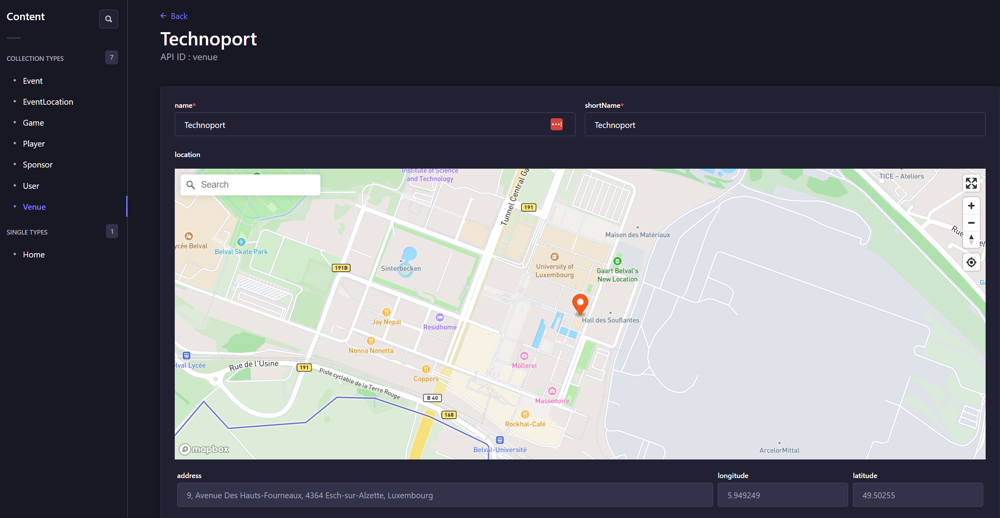

# Strapi plugin `map-field`

The `map-field` [Strapi](https://strapi.io/) plugin allows to add a [Mapbox](https://www.mapbox.com/) map custom field in your content-types. 



You can use the seach box to pinpoint the location you are looking for. Alternatively, you can double-click anywhere on the map, which will put a marker on the closest geolocated point.

The address, longitude and latitude of the geolocated point are displayed in the readonly fields underneath the map.

The field will actually be stored as [GeoJSON](https://geojson.org/) in a JSON field behing the scene.

```js
{
  "id": "address.7351440929350024",
  "text": "Avenue Des Hauts-Fourneaux",
  "type": "Feature",
  "center": [
    5.949249,
    49.50255
  ],
  "address": "9",
  "context": [
    {
      "id": "postcode.13299336",
      "text": "4364"
    },
    {
      "id": "place.1271944",
      "text": "Esch-sur-Alzette",
      "wikidata": "Q16010"
    },
    {
      "id": "region.9352",
      "text": "Esch-sur-Alzette",
      "wikidata": "Q188283",
      "short_code": "LU-ES"
    },
    {
      "id": "country.8840",
      "text": "Luxembourg",
      "wikidata": "Q32",
      "short_code": "lu"
    }
  ],
  "geometry": {
    "type": "Point",
    "coordinates": [
      5.949249,
      49.50255
    ]
  },
  "relevance": 0.735,
  "place_name": "9, Avenue Des Hauts-Fourneaux, 4364 Esch-sur-Alzette, Luxembourg",
  "place_type": [
    "address"
  ],
  "properties": {
    "accuracy": "rooftop"
  }
}
```

This plugin was inspired by
* [Customizing fields in the Strapi admin panel by Cyril Lopez](https://www.youtube.com/watch?v=55KJ2sCX8ws)
* [How to Create a Custom Admin UI Field Component in Strapi](https://medium.com/@dallasclark/how-to-create-a-custom-admin-ui-field-component-in-strapi-2c9cd367f262)

It uses the following npm packages
* [mapbox-gl](https://www.npmjs.com/package/mapbox-gl)
* [react-map-gl](https://www.npmjs.com/package/react-map-gl)
* [@mapbox/mapbox-sdk](https://www.npmjs.com/package/@mapbox/mapbox-sdk)
* [@mapbox/mapbox-gl-geocoder](https://www.npmjs.com/package/@mapbox/mapbox-gl-geocoder)

## Configure the plugin

You need to enable the plugin in your Strapi plugins configuration.

Open `config/plugins.js` and add the following:

```js
// config/plugins.js
module.exports = ({ env }) => ({

  ...

  "map-field": {
    enabled: true,
  },

  ...

});

```

## Provide a valid Mapbox Access Token

Add a valid [Mapbox Access Token](https://docs.mapbox.com/help/getting-started/access-tokens/) as an environment variable in your `.env` file

```bash
# .env
STRAPI_ADMIN_MAPBOX_ACCESS_TOKEN=pk.xxxxxxxxxxxxxxxxxxxxxxxxxxxxxxxxxxxxxxxxxxxxxxxxxxxxxx.xxxxxxxxxxxxxxxxx

```


## Enable the plugin on a JSON field in your content-type

In order for the map to replace the default JSON field editor in the Admin Panel, you need to enable the plugin on that JSON field in your content-type definition.

This can be done by manually editing the content-type file and adding a `pluginOptions` section.

Let's imagine that you have a content-type collection called `dummy` with a JSON field called `location`.

```js
// in your content-type definition
{
  "kind": "collectionType",
  "collectionName": "dummy",

  ...

  "location": {
      "type": "json"
    }
  }
}

```

Simply add the `pluginOptions` as follow: 

```js
// in your content-type definition
{
  "kind": "collectionType",
  "collectionName": "dummy",

  ...

  "location": {
      "type": "json",
      "pluginOptions": {
        "map-field": {
          "enabled": true
        }
      }
    }
  }
}

```

Above, `map-field` corresponds to this plugin name. You cannot change that, otherwise it will not work.

You can disable the plugin at any moment by setting the `enabled` flag to `false`. This will display the default JSON field again, instead of the map.
